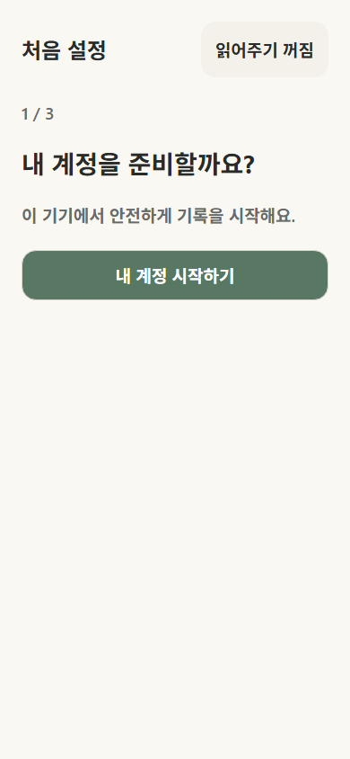
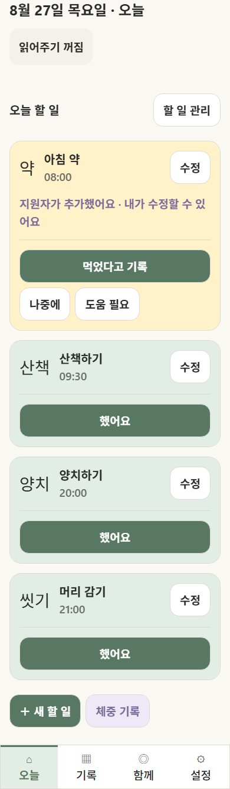

# 하루한칸 사용설명서

## 처음 시작할 때

1. `내 계정 시작하기`를 누릅니다.
2. `쉬운 모드` 또는 `일반 모드`를 고릅니다.
3. 읽어주기 사용 여부를 고르고 `완료`를 누릅니다.
4. 지원자를 연결하거나 `나중에`를 눌러 오늘 화면으로 이동합니다.

## 오늘 할 일 기록하기

- 끝낸 일은 카드 안의 `했어요`를 누릅니다.
- 약은 `먹었다고 기록`, `나중에`, `도움 필요` 중 하나를 누릅니다.
- 실수로 눌렀다면 화면 아래의 `되돌리기`를 누릅니다.

## 내 할 일 바꾸기

- 오늘 화면의 `할 일 관리`에서 순서를 바꾸거나 수정합니다.
- `+ 새 할 일`에서 이름, 아이콘, 시간, 반복 요일을 정합니다.
- 반복 일정을 바꿀 때는 `오늘만` 또는 `오늘부터 계속`을 확인합니다.

## 체중과 지난 기록

- `체중 기록`에서 숫자를 확인하고 저장합니다.
- 아래 메뉴의 `기록`에서 주간·월간 체크표를 봅니다.
- 빈칸은 실패가 아니라 `기록 없음` 또는 `예정 없음`입니다.

## 함께 관리

현재 버전의 지원자 연결은 한 기기 안에서 사용 흐름을 확인하는 시연 기능입니다. 실제 다른 휴대폰과 동기화하려면 Supabase 원격 공유 기능을 추가해야 합니다.

## 이럴 땐 이렇게

- 화면이 열리지 않아요: 인터넷 연결을 확인한 뒤 `다시 시도`를 누릅니다.
- 설치 메뉴가 없어요: Safari 또는 Chrome에서 배포 주소를 직접 열고 새로고침합니다.
- 기록이 사라졌어요: 브라우저 데이터나 PWA를 삭제하면 현재 로컬 기록을 복구할 수 없습니다.
- 알림이 오지 않아요: 웹 PWA와 휴대폰 설정에 따라 알림이 제한될 수 있습니다. 현재 체크 기록은 알림 없이도 사용할 수 있습니다.
